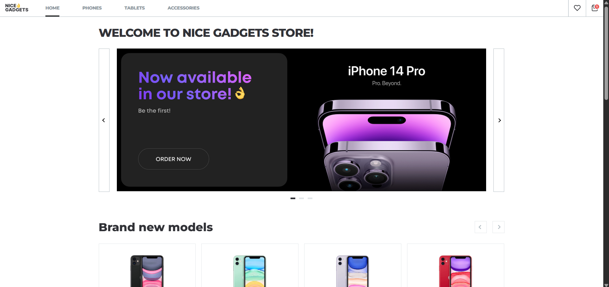

# Phone Catalog App

# [Demo](https://IOherhi.github.io/react-phones-catalog)

This is a React app built using modern technologies and interface development approaches.

## Technologies

- **HTML5** — modern semantic markup
- **SCSS Modules** — scoped and modular styling
- **React** + **TypeScript (TSX)** — component-based architecture with strict typing
- **React Router** — client-side routing
- **Vite** — fast bundler and dev server
- **IntersectionObserver API** — tracking elements in the viewport (used for lazy loading, active states, etc.)
- **SwiperJS** — basic usage of sliders/carousels
- **Fetch API** — asynchronous HTTP requests to the server
- **localStorage** — persistent storage for user state (e.g., cart, favorites)
- **Responsive Design** — adaptability for different screen sizes
- **Git + GitHub** — version control and deployment

## Main Project Structure

- **Home page**: presentation page with a slider and popular products.
- **Category pages**: phones, tablets, accessories. Each of them:

  - Includes filtering
  - Supports pagination (4 / 8 / 16 items per page)

- **Product page**:

  - Product image gallery
  - Color and memory size selection
  - Add to cart or favorites

- **Favorites page**:

  - Shows saved products (phones, tablets, watches)
  - Data is stored in `localStorage`

- **Cart page**:

  - Supports adding/removing products
  - Calculates total sum
  - Data is stored in `localStorage`

- **Responsive design**:
  - Supports three modes: mobile, tablet, desktop
  - Menu is compact but functional

## 🚀 Features

- Add to favorites and cart from any product block displayed
- Uses `IntersectionObserver` to synchronize images on the home page
- Initial implementation of **Swiper** integration (basic functionality working)
- Fully functional **dots navigation** under the main slider on the Home page
- Components are reused across different pages
- Filtering and sorting work through URLSearchParams.

